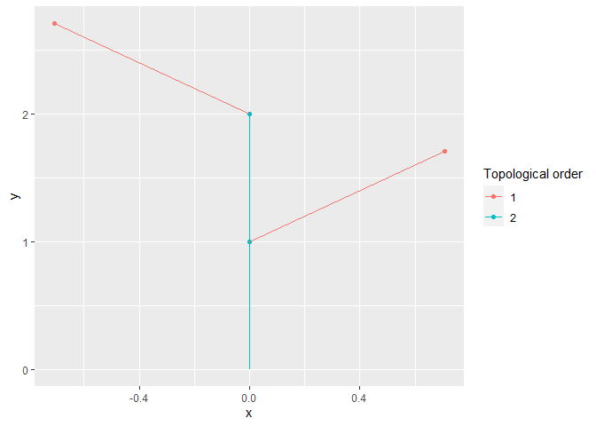

<!-- README.md is generated from README.Rmd. Please edit that file -->

# XploRer

<!-- badges: start -->

[](https://www.repostatus.org/#wip)  
[](https://github.com/VEZY/XploRer/actions)
<!-- badges: end -->

The goal of XploRer is to read, write, analyze and plot MTG (Multi-scale
Tree Graph) files. These files describe the plant topology
(i.e. structure) along with some attributes for each node
(e.g. geometry, colors, state…).

> The package is under intensive development and is in a very early
> version. The functions may heavily change from one version to another
> until a more stable version is released.

## Table of Contents

  - [1. Installation](#1-installation)
  - [2. Examples](#2-examples)
      - [2.1 Reading a file](#21-reading-a-file)
      - [2.2 Mutate](#22-mutate-the-mtg)
      - [2.3 Plot](#22-plotting-a-plant)
  - [3. Help](#3-help)

## 1\. Installation

you can install the release version of XploRer from
[GitHub](https://github.com/) with:

``` r
# install.packages("devtools")
devtools::install_github("VEZY/XploRer")
```

## 2\. Examples

### 2.1 Reading a file

Read a simple MTG file:

``` r
library(XploRer)

MTG = read_mtg("https://raw.githubusercontent.com/VEZY/XploRer/master/inst/extdata/simple_plant.mtg")
```

The `read_mtg()` function returns a list of 4:

  - classes: a `data.frame` that holds information about the type of
    nodes used in the MTG (e.g. Internode, Leaf, etc…), the MTG scale
    for each one, and some more details. Here is the classes
    `data.frame` from our example:
    
    ``` r
    MTG$classes
    #>       SYMBOL SCALE DECOMPOSITION INDEXATION DEFINITION
    #> 1          $     0          FREE       FREE   IMPLICIT
    #> 2  Internode     6          FREE       FREE   IMPLICIT
    #> 3 Individual     1          FREE       FREE   IMPLICIT
    #> 4       Leaf     2          FREE       FREE   IMPLICIT
    #> 5       Axis     2          FREE       FREE   IMPLICIT
    ```

  - description: a `data.frame` defining the potential topological
    constraints existing between nodes. Here is the description
    `data.frame` from our example:
    
    ``` r
    MTG$description
    #>        LEFT           RIGHT RELTYPE MAX
    #> 1 Internode Internode, Leaf       +   ?
    #> 2 Internode Internode, Leaf       <   ?
    ```

  - features: a `data.frame` listing all attributes present in the file
    and their associated type. Here is the features `data.frame` from
    our example:
    
    ``` r
    MTG$features
    #>       NAME  TYPE
    #> 1       XX  REAL
    #> 2       YY  REAL
    #> 3       ZZ  REAL
    #> 4 FileName ALPHA
    #> 5   Length ALPHA
    #> 6    Width ALPHA
    #> 7   XEuler  REAL
    ```

  - MTG: a `data.tree` structure defining all nodes, their attributes
    and their relationships:
    
    ``` r
    MTG$MTG
    #>                levelName
    #> 1 node_1                
    #> 2  °--node_2            
    #> 3      °--node_3        
    #> 4          ¦--node_4    
    #> 5          °--node_5    
    #> 6              °--node_6
    ```

#### 2.2 Print/extract variables

The variable of an MTG can be printed using the `print()` function,
*e.g.*:

``` r
print(MTG$MTG, ".symbol", "Length")
#>                levelName    .symbol Length
#> 1 node_1                 Individual     NA
#> 2  °--node_2                   Axis     NA
#> 3      °--node_3          Internode      4
#> 4          ¦--node_4           Leaf     10
#> 5          °--node_5      Internode      6
#> 6              °--node_6       Leaf     12
```

The variables can also be extracted in a `data.frame()` using the
functions from the `data.tree` package *e.g.*:

``` r
data.tree::ToDataFrameTree(MTG$MTG,"Length","Width")
#>                levelName Length Width
#> 1 node_1                     NA    NA
#> 2  °--node_2                 NA    NA
#> 3      °--node_3              4     1
#> 4          ¦--node_4         10     6
#> 5          °--node_5          6    NA
#> 6              °--node_6     12     7
```

### 2.3 Mutate the MTG

The attributes (also known as features or variables) of the MTG can be
mutated using `mutate_mtg()`. It allows to compute new variables, or
modify the existing ones.

#### 2.3.1 Compute new variables

`mutate_mtg()` borrows its syntax from `dplyr`. We can compute a new
variable based on the values of others:

``` r
# Import the MTG:
filepath= system.file("extdata", "simple_plant.mtg", package = "XploRer")
MTG = read_mtg(filepath)

# And mutate it by adding two new variables, Length2 and Length3:
mutate_mtg(MTG, Length2 = node$Length + 2, Length3 = node$Length2 * 2)
```

We can note two things here:

1.  We use `node$` to access the values of a variable inside the MTG.
    This is done to avoid any conflicts between variables from the MTG,
    and variables from your environment;

2.  `Length3` uses the results of `Length2` before it even exist. This
    is very powerful to construct many new variables at once. It is
    allowed thanks to a sequential construction of the variables.

As with `dplyr` main functions, `mutate_mtg()` can be used with pipes:

``` r
read_mtg(filepath)%>%
  mutate_mtg(Length2 = node$Length + 2)
```

This is allowed because the function returns the results invisibly. Note
that it is mutating the MTG in place though, so no need to assign the
results of `mutate_mtg()` to a variable.

#### 2.3.2 Using parent values

You can also use functions inside the call of the function. Some helpers
are provided by the package to compute variables based on the ancestors
or children of the node (see `get_parent_value()`,
`get_children_values()` and `get_ancestors_values()`). Here is an
example were we define a new variable called `Length_parent` that is the
length of the node’s parent:

``` r
mutate_mtg(MTG, Length_parent = get_parent_value("Length"))
```

`get_parent_value()` is used to get the value of the “Length” variable
from the parent of each node.

If we need the values of all ancestors of a node along the tree, we can
use `get_ancestors_values()` instead:

``` r
mutate_mtg(MTG, total_length = sum(get_ancestors_values("Length",self = TRUE),na.rm = TRUE))
```

Here are the results for both:

``` r
print(MTG$MTG,".symbol","Length","Length_parent","total_length")
#>                levelName    .symbol Length Length_parent total_length
#> 1 node_1                 Individual     NA            NA            0
#> 2  °--node_2                   Axis     NA            NA            0
#> 3      °--node_3          Internode      4            NA            4
#> 4          ¦--node_4           Leaf     10             4           14
#> 5          °--node_5      Internode      6             4           10
#> 6              °--node_6       Leaf     12             6           22
```

#### 2.3.3 Using children values

To get the children values of a node, use `get_children_values()`. This
function returns the values of a field for all children of a node:

``` r
get_children_values(attribute = "Length", node = data.tree::FindNode(MTG$MTG, "node_3"))
#> node_4 node_5 
#>     10      6
```

It can be used to get *e.g.* the average length of the children:

``` r
mutate_mtg(MTG, children_length = mean(get_children_values("Length"), na.rm = TRUE))
print(MTG$MTG, ".symbol", "Length","children_length")
#>                levelName    .symbol Length children_length
#> 1 node_1                 Individual     NA             NaN
#> 2  °--node_2                   Axis     NA               4
#> 3      °--node_3          Internode      4               8
#> 4          ¦--node_4           Leaf     10             NaN
#> 5          °--node_5      Internode      6              12
#> 6              °--node_6       Leaf     12             NaN
```

#### 2.2.4 Combine values

We can also make more complex associations. Here is an example were we
need the sum of the surface of the section of all children for the
nodes, but only for the nodes of scale “S”:

``` r
mutate_mtg(MTG, section_surface = pi * ((node$Width / 2)^2),
           s_surf_child_sum = sum(get_children_values("section_surface",scale = "S"),na.rm=TRUE))
```

We first compute the surface of the section of each node, and then we
sum the values for all children of the nodes. This is helpful to check
if our MTG follows the pipe model.

#### 2.2.5 Filter by scale

We can also filter the parent by scale, *i.e.* the name of the SYMBOL
from the MTG classes, which corresponds to the `.symbol` value in the
node.

To get the possible values for the SYMBOLS in an MTG:

``` r
MTG$classes$SYMBOL
#> [1] "$"          "Internode"  "Individual" "Leaf"       "Axis"
```

To get the symbol of a node use the `.symbol` field on a node:

``` r
MTG$MTG$.symbol
#> [1] "Individual"
```

To filter the parent node by its scale, use the `scale` argument:

``` r
get_parent_value(attribute = "Length", node = data.tree::FindNode(MTG$MTG, "node_6"), scale = "Axis")
#> [1] NA
```

Here it returns `NA` because the first parent is an `Internode`, and the
first node with scale “Axis” (`node_2`) has no values for “Length”, see
by yourself:

``` r
print(MTG$MTG, ".symbol", "Length")
#>                levelName    .symbol Length
#> 1 node_1                 Individual     NA
#> 2  °--node_2                   Axis     NA
#> 3      °--node_3          Internode      4
#> 4          ¦--node_4           Leaf     10
#> 5          °--node_5      Internode      6
#> 6              °--node_6       Leaf     12
```

Several functions implements their own way to deal with scales.
`get_parent_value()`, `get_ancestors_values()` and
`get_children_values()` all share a `scale` argument to filter the
parents by scale. By default, the function will return the values from
the first ancestor with the required scale by “climbing” the tree from
one node to the other (starting from the node of interest). If none of
the ancestors are of the required scale, then the function returns `NA`.

The `recursive` argument can be used in `get_parent_value()` and
`get_children_values()` functions to disable this default behavior of
“climbing”, so the function will return `NA` if the first parent is
not of the right scale.

Here is an example with recursive behavior:

``` r
get_children_values(attribute = "Length", node = MTG$MTG$node_2, scale = "Leaf")
#> node_4 node_6 
#>     10     12
```

And without:

``` r
get_children_values(attribute = "Length", node = MTG$MTG$node_2, scale = "Leaf", recursive = FALSE)
#> [1] NA
```

Here it returns `NA` because “node\_2” has one child (“node\_3”) that is
not of the right scale, but `recursive = FALSE` so the function just
returns `NA`.

> Note that `get_ancestors_values()` does not have the `recursive`
> argument because it is a recursive function by design. So if an
> ancestor is not of the right scale, it just passes to the next
> ancestor.

`mutate_mtg()` has a `.scale` argument that is used similarly to the
`scale` argument of the other functions. The only difference is that the
functions inside a `mutate_mtg()` call will only be applied to the nodes
of the chosen scales, but once the function called, it will still have
access to the node parents and children if needed. Furthermore, the
`.scale` argument is applied to all functions inside the `mutate_mtg()`
call.

The advantage is we can combine the `.scale` argument from
`mutate_mtg()` and then the `scale` argument from the other functions in
a single call. If you need a computation at one scale for a variable but
at another scale for another, it is preferable to use multiple calls to
`mutate_mtg()`, possibly chained using a pipe, *e.g.*:

``` r
mutate_mtg(MTG, section_surface = pi * ((node$Width / 2)^2),
          .scale = "Internode")%>%
mutate_mtg(area = node$Width * node$Length, .scale = "Leaf")

print(MTG$MTG, ".symbol", "Width","section_surface", "area")
#>                levelName    .symbol Width section_surface area
#> 1 node_1                 Individual    NA              NA   NA
#> 2  °--node_2                   Axis    NA              NA   NA
#> 3      °--node_3          Internode     1       0.7853982   NA
#> 4          ¦--node_4           Leaf     6      28.2743339   60
#> 5          °--node_5      Internode    NA              NA   NA
#> 6              °--node_6       Leaf     7      38.4845100   84
```

### 2.3 Plotting a plant

#### 2.3.1 Static plot

The plant topology can be plotted using the `autoplot()` function. This
function is implemented by `ggplot2` so you’ll need to load this package
before-hand:

``` r
library(ggplot2)
#> Warning: package 'ggplot2' was built under R version 3.6.3
autoplot(MTG)
```



The function can be used in a pipe, such as:

``` r
read_mtg(filepath)%>%
  mutate_mtg(Length2 = node$Length + 2)%>%
  autoplot(.)
```

#### 2.3.2 Interactive plot

The same plot can be rendered as an interactive plot using:

``` r
plotly_MTG(MTG)
```


`plotly_MTG()` uses the [plotly API](https://plotly.com/) under the
hood.

It is also possible to add any variable in the tooltip appearing on
hover of a node by adding it to the call. For example if we need the
`Length` and the `Width` of the nodes, we would write:

``` r
plotly_mtg(MTG, Length, Width)
```

## 3\. Help

Please see the [OpenAlea
documentation](http://openalea.gforge.inria.fr/doc/vplants/newmtg/doc/_build/html/contents.html)
(especially chapter 8) for more details on the MTG files.

If you have any other problem related to the package, please feel free
to [fill an issue](https://github.com/VEZY/XploRer/issues) on Github.
