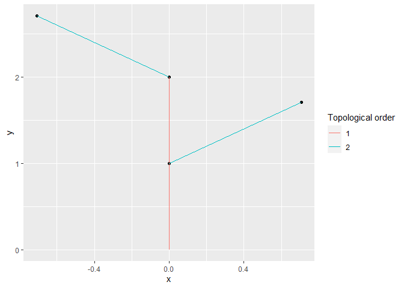

<!-- README.md is generated from README.Rmd. Please edit that file -->

# XploRer

<!-- badges: start -->

[](https://www.repostatus.org/#wip)  
[](https://github.com/VEZY/XploRer/actions)
<!-- badges: end -->

The goal of XploRer is to read, write, analyze and plot MTG (Multi-scale
Tree Graph) files. These files describe the plant topology
(i.e. structure) along with some attributes for each node
(e.g. geometry, colors, state…).

> The package is under intensive development and is in a very early
> version. The functions may heavily change from one version to another
> until a more stable version is released.

## Table of Contents

  - [1. Installation](#1-installation)
  - [2. Examples](#2-examples)
      - [2.1 Reading a file](#21-reading-a-file)
      - [2.2 Plot](#22-plotting-a-plant)
  - [3. Help](#3-help)

## 1\. Installation

you can install the release version of XploRer from
[GitHub](https://github.com/) with:

``` r
# install.packages("devtools")
devtools::install_github("VEZY/XploRer")
```

## 2\. Examples

### 2.1 Reading a file

Read a simple MTG file:

``` r
library(XploRer)
MTG = read_MTG("https://raw.githubusercontent.com/VEZY/XploRer/master/inst/extdata/simple_plant.mtg")
```

The `read_MTG()` function returns a list of 4:

  - classes: a `data.frame` that holds information about the type of
    nodes used in the MTG (e.g. Internode, Leaf, etc…), the MTG scale
    for each one, and some more details. Here is the classes
    `data.frame` from our example:
    
    ``` r
    MTG$classes
    #>       SYMBOL SCALE DECOMPOSITION INDEXATION DEFINITION
    #> 1          $     0          FREE       FREE   IMPLICIT
    #> 2  Internode     6          FREE       FREE   IMPLICIT
    #> 3 Individual     1          FREE       FREE   IMPLICIT
    #> 4       Leaf     2          FREE       FREE   IMPLICIT
    #> 5       Axis     2          FREE       FREE   IMPLICIT
    ```

  - description: a `data.frame` defining the potential topological
    constraints existing between nodes. Here is the description
    `data.frame` from our example:
    
    ``` r
    MTG$description
    #>        LEFT           RIGHT RELTYPE MAX
    #> 1 Internode Internode, Leaf       +   ?
    #> 2 Internode Internode, Leaf       <   ?
    ```

  - features: a `data.frame` listing all attributes present in the file
    and their associated type. Here is the features `data.frame` from
    our example:
    
    ``` r
    MTG$features
    #>       NAME  TYPE
    #> 1       XX  REAL
    #> 2       YY  REAL
    #> 3       ZZ  REAL
    #> 4 FileName ALPHA
    #> 5   Length ALPHA
    #> 6    Width ALPHA
    #> 7   XEuler  REAL
    ```

  - MTG: a `data.tree` strucuture defining all nodes, their attributes
    and their relationships:
    
    ``` r
    MTG$MTG
    #>                levelName
    #> 1 node_1                
    #> 2  °--node_2            
    #> 3      °--node_3        
    #> 4          ¦--node_4    
    #> 5          °--node_5    
    #> 6              °--node_6
    ```

### 2.2 Plotting a plant

The plant topology can be plotted using the `plot_MTG()` function:

``` r
plot_MTG(MTG)
```



## 3\. Help

Please see the [OpenAlea
documentation](http://openalea.gforge.inria.fr/doc/vplants/newmtg/doc/_build/html/contents.html)
(especially chapter 8) for more details on the MTG files.

If you have any other problem related to the package, please feel free
to [fill an issue](https://github.com/VEZY/XploRer/issues) on Github.
